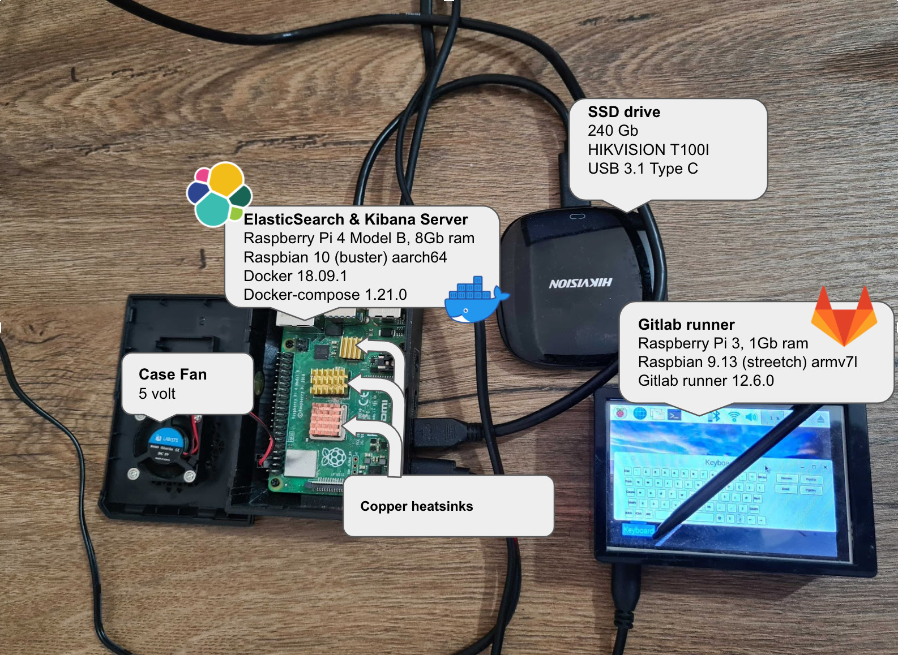
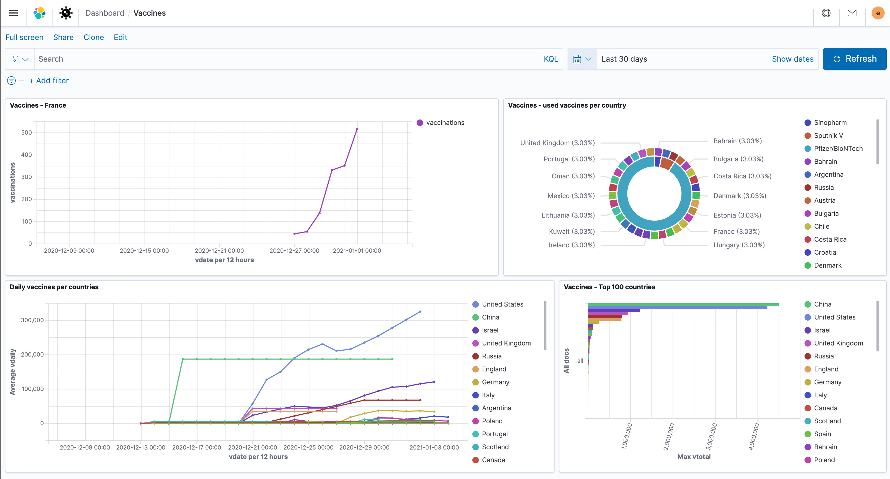
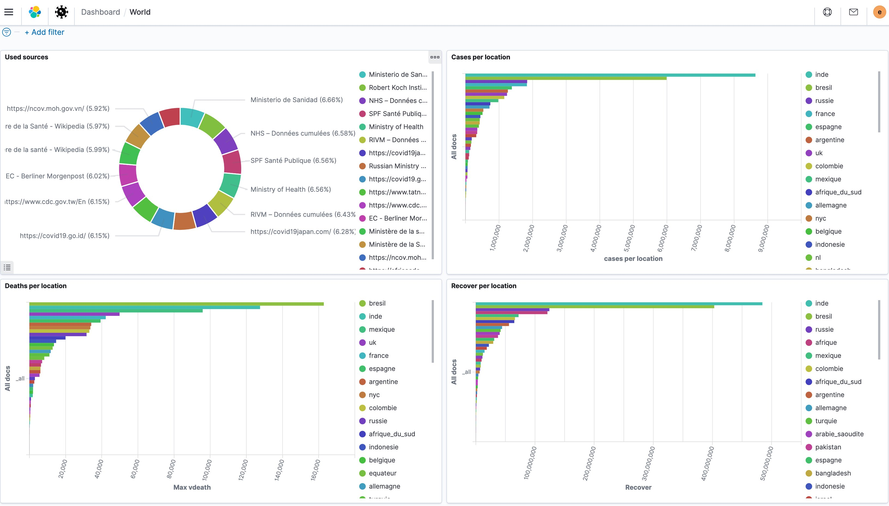
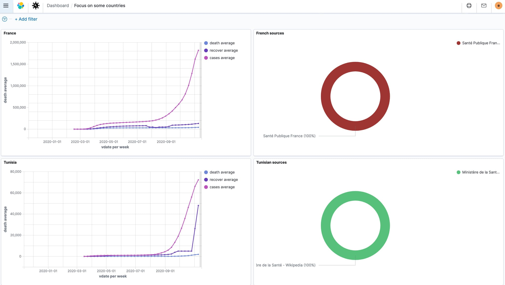
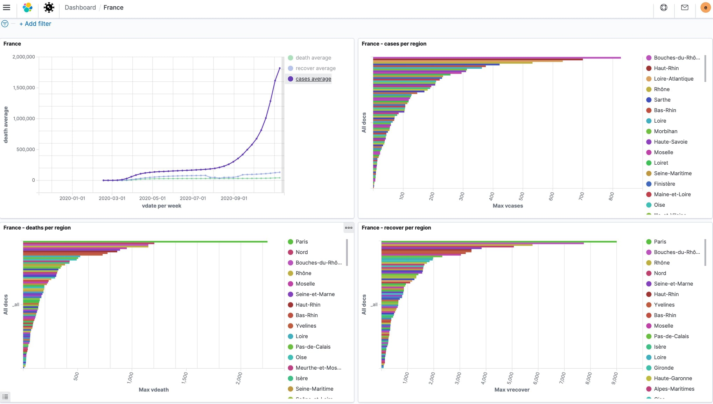
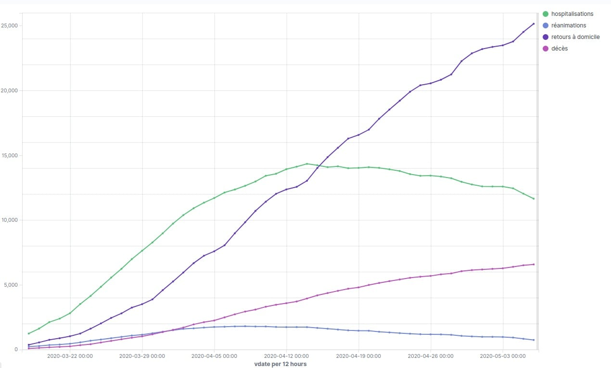
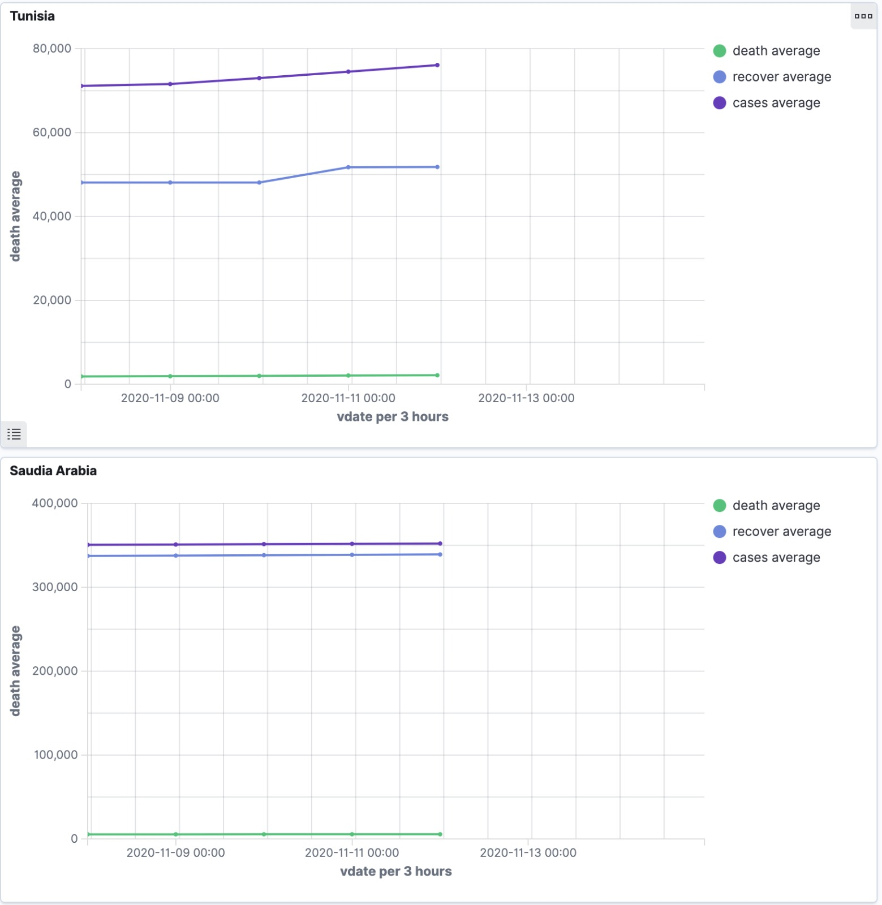
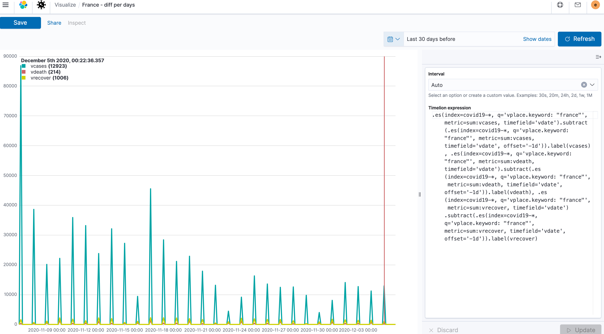

# Covid19 stats

This project aims to provide a docker image or a script that will allow you to index some covid19 opendata into [ElasticSearch](https://www.elastic.co/elasticsearch).

Then you'll be able to make some dashboards and graphs on [Kibana](https://www.elastic.co/kibana) or [Grafana](https://grafana.com).

## Table of content

[[_TOC_]]
## Git repo

* Main repo: https://gitlab.comwork.io/oss/covid19
* Github mirror repo: https://github.com/idrissneumann/covid19

## Talks / demos

### ElasticFr Meetup 21/08/2021 (in French)

[](http://www.youtube.com/watch?v=BC1iSnoe15k "")


You'll find some slides presented during some online meetup like the ElasticFR meetup [here](./talks/elasticfr_meetup.pdf)
## Getting started

### Setup with Raspberry Pi

This is the Raspberry Pi setup used by the maintener in order to build the ARM image (which is available on docker-hub) and to run it with a minimal ElasticStack which is also built for ARM (see [this repo](https://gitlab.comwork.io/oss/elasticstack/elasticstack-arm)).



If you have two Raspberry Pi 4 model B, 4gb or raspberry Pi 400 instead, with one hosting ElasticSearch and the other Kibana, it should be fine. You'll just have to change the Kibana environment variable `ES_HOST` in the docker-compose file to replace the elastic hostname by the ip on the network. See the section below in order to get more details.

### With docker

A docker image is delivered on docker-hub for `x86` and `arm` achitecture here: https://hub.docker.com/repository/docker/comworkio/covid-stats

You can use the following tags for x86:

```shell
docker pull comworkio/covid-stats:latest # x86
docker pull comworkio/covid-stats:latest-x86 # x86
docker pull comworkio/covid-stats:1.0 # x86
docker pull comworkio/covid-stats:1.0-{sha} # x86
```

You can use the following tags for arm:

```shell
docker pull comworkio/covid-stats:latest-arm # x86
docker pull comworkio/covid-stats:1.0-arm # x86
docker pull comworkio/covid-stats:1.0-{sha}-arm # x86
```

Those tags are built on and optimized for raspberrypi.

Refer to the "Without docker" section in order to pick the same index patterns configurations and role (points **1** and **4**).

### Minamal environment with docker-compose

Pick the docker-compose file corresponding to your own architecture:
* `docker-compose-x86.yml`: x86 (vps on the cloud, etc)
* `docker-compose-arm.yml`: arm (raspberrypi, etc)

Refer to the "Without docker" section in order to pick the same index patterns configurations (point **4**).

If you want to host all containers in the same host:

```shell
$ docker-compose -f docker-compose-x86.yml up -d # on x86
$ docker-compose -f docker-compose-arm.yml up -d # on arm
```

If you want to use multiple host on different docker-network, you'll have to adapt those files (changing the environment variables, removing the docker network, etc).

Then you can access to Kibana on your browser using this url: `http://{ip of the server hosting Kibana}:5601`.

### Without docker

**0/** you need to install the following dependancies:

* bash >= 4
* coreutils
* jq
* getopt
* curl
* cron
* ElasticStack / ELK (ElasticSearch and Kibana are enough)

**1/** configure your elastic role and user with the `all` rights on the following indice pattern:
* `covid19-*`
* `gouvfr-covid19-*`
* `vaccine-covid19-*`

You also can export the saved objects [here](./kibana_saved_objects) on Kibana. You'll also have some graph and dashboards.

**2/** change the three following variables in the `get_stats.sh`:

```shell
[[ ! $ELASTIC_URL ]] && export ELASTIC_URL="changeit"
[[ ! $ELASTIC_USERNAME ]] && export ELASTIC_USERNAME="changeit"
[[ ! $ELASTIC_PASSWORD ]] && export ELASTIC_PASSWORD="changeit"
```

As you can see, you also can `export` them before running the script instead of override the values directly inside.

**3/** you just need to add a crontab to keep the data up to date once per day:

```shell
0 0 * * * /home/centos/covid19/get_stats.sh -a
```

**4/** You can add to your Kibana the following index pattern in order to discover the data and be able to make your graphs:
* `covid19-*`
* `gouvfr-age-covid19-*`
* `gouvfr-covid19-*`
* `gouvfr-ets-covid19-*`
* `gouvfr-new-covid19-*`
* `vaccine-covid19-vaccinefr-*`
* `vaccine-covid19-vaccinations-*`
* `vaccine-covid19-vaccinelocations-*`

You also can export the saved objects [here](./kibana_saved_objects) on Kibana. You'll also have some graph and dashboards.

## Datasources

* https://www.coronavirus-statistiques.com : world stats
* https://www.data.gouv.fr : for the French stats
* https://github.com/owid/covid-19-data : for vaccine data (worldwide)
* https://github.com/rozierguillaume/vaccintracker : for french vaccine data

## Data types

All the data are converted to a JSON document that will be indexed and contains some of the following fields:

* `vplace`: geographical place (country, continent, region, department, etc)
* `vcode`: kind of geographical place (country, continent, region, department, etc)
* `vcases`: number of positive cases or new hospitalization (depanding of the datasource)
* `vdeath`: number of death
* `vrecover`: number of recover or people that went back to their home after hospitalization
* `vrea`: number of people in intensive care
* `vsource`: the source of the data (governments, wikipedia, etc)
## Examples of dashboard with Kibana













## Example of using Timelion with the data

Here we subtract between the cumulative amounts of the day and the day before in order to obtain the number of new cases per day:



The timelion expression:

```shell
.es(index=covid19-*, q='vplace.keyword: "france"', metric=sum:vcases, timefield='vdate').subtract(.es(index=covid19-*, q='vplace.keyword: "france"', metric=sum:vcases, timefield='vdate', offset='-1d')).label(vcases).color(blue), .es(index=covid19-*, q='vplace.keyword: "france"', metric=sum:vdeath, timefield='vdate').subtract(.es(index=covid19-*, q='vplace.keyword: "france"', metric=sum:vdeath, timefield='vdate', offset='-1d')).label(vdeath).color(red), .es(index=covid19-*, q='vplace.keyword: "france"', metric=sum:vrecover, timefield='vdate').subtract(.es(index=covid19-*, q='vplace.keyword: "france"', metric=sum:vrecover, timefield='vdate', offset='-1d')).label(vrecover).color(green)
```

Replace `france` by any country you want and which are available in the dataset.
